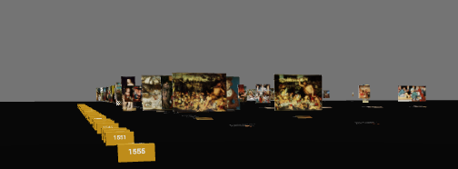

# Web Technologies // Project 2022

Zum Modul Web Technologien gibt es ein begleitendes Projekt. Im Rahmen dieses Projekts werden wir von Veranstaltung zu Veranstaltung ein Projekt sukzessive weiter entwickeln und uns im Rahmen der Veranstaltung den Fortschritt anschauen, Code Reviews machen und Entwicklungsschritte vorstellen und diskutieren.

Als organisatorischen Rahmen für das Projekt nutzen wir GitHub Classroom. Inhaltlich befassen wir uns mit der Entwicklung einer kleinen Web-Anwendung für die Bearbeitung von Bildern. Hierbei steht weniger ein professioneller Konzeptions-, Entwurfs- und Entwicklungsprozess im Vordergrund, sondern vielmehr die sukzessive Weiterentwicklung einer Anwendung, das Ausprobieren, Vergleichen, Refactoren und die Freude an lauffähigem Code.

## Team
Author: [Linnéa Doberstein](https://github.com/Moosgloeckchen)  
Reviewer: [Max Hammer](https://github.com/MaxHam)

## Domain
[https://moosgloeckchen.github.io/](https://moosgloeckchen.github.io/)

## Quick start

To start the Project Docker Compose must be installed on the device. After that, follow these steps:

1. Clone project
2. Copy prepared Cranach images into a new folder `data` inside the `frontend` folder:
    ```
    auth/
    docs/
    frontend/
        data
        src
    ```
3. Create and start the service via `docker-compose up -d --build` from inside the folder `frontend`.
4. Finally call [localhost:3000](http://localhost:3000)
5. To shut down the container, use `docker-compose down --remove-orphans`.

## Decision Records
Interested in decisions made along the way? Have a look at the [Architectural Decision Records (ADR's)](./docs/decisions/README.md).

## Process documentations
* [Kanban Board](https://github.com/mi-classroom/mi-web-technologien-beiboot-ss2022-Moosgloeckchen/projects/1)
* [Github Workflow](./docs/review-process.md)
* [Timetracking](https://github.com/mi-classroom/mi-web-technologien-beiboot-ss2022-Moosgloeckchen/issues/7)
* [Challenges](./docs/challenges.md)

## Notes
This implementation is a prototype.
This prototype should give a preview of a display of Cranachs paintings.